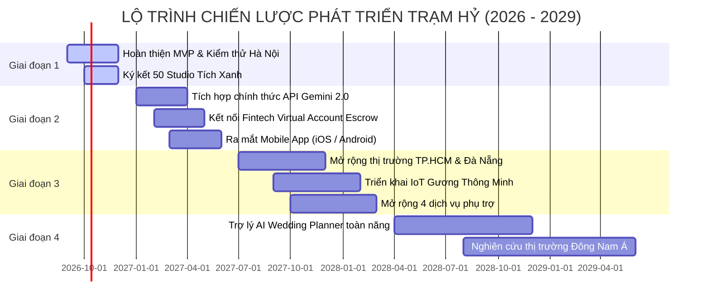

# 💍 TRẠM HỶ (WEDDING TECH PLATFORM)
## TÀI LIỆU TOÀN DIỆN DỰ ÁN & ĐỊNH HƯỚNG PHÁT TRIỂN CHIẾN LƯỢC
> **Nền Tảng Thử Váy Cưới Công Nghệ AR, May Đo Thiết Kế AI & Bảo Chứng Cọc 2 Chiều Hàng Đầu Việt Nam**  
> *Đơn vị phát triển: Group 5 – Lớp SE1936-NET (Dự án Khởi nghiệp EXE101 / EXE201 / EXE202)*  
> *Giảng viên hướng dẫn: Cô Đoàn Thị Thanh Hương | Thầy Đặng Trần Hiếu*  
> *Mentor: Cô Bùi Mai Phương*  
> *Phiên bản tài liệu: 2.0 (Cập nhật tháng 10/2026)*

---

## 📑 MỤC LỤC
1. [TỔNG QUAN DỰ ÁN TRẠM HỶ](#1-tổng-quan-dự-án-trạm-hỷ)
2. [BỐI CẢNH THỊ TRƯỜNG & VẤN ĐỀ CẦN GIẢI QUYẾT](#2-bối-cảnh-thị-trường--vấn-đề-cần-giải-quyết)
3. [HỆ THỐNG GIẢI PHÁP ĐỘT PHÁ & USP CỦA TRẠM HỶ](#3-hệ-thống-giải-pháp-đột-phá--usp-của-trạm-hỷ)
4. [KIẾN TRÚC HỆ THỐNG & SITEMAP TÍNH NĂNG ĐÃ TRIỂN KHAI](#4-kiến-trúc-hệ-thống--sitemap-tính-năng-đã-triển-khai)
5. [MÔ HÌNH KINH DOANH (BUSINESS MODEL CANVAS)](#5-mô-hình-kinh-doanh-business-model-canvas)
6. [PHÂN TÍCH TÀI CHÍNH & DỰ BÁO TĂNG TRƯỞNG](#6-phân-tích-tài-chính--dự-báo-tăng-trưởng)
7. [ĐỊNH HƯỚNG PHÁT TRIỂN CHIẾN LƯỢC (ROADMAP 2026 - 2029)](#7-định-hướng-phát-triển-chiến-lược-roadmap-2026---2029)
8. [HƯỚNG DẪN CÀI ĐẶT & CHẠY DEMO](#8-hướng-dẫn-cài-đặt--chạy-demo)

---

## 1. TỔNG QUAN DỰ ÁN TRẠM HỶ

### 1.1. Giới Thiệu Chung
**Trạm Hỷ** là nền tảng số hóa hệ sinh thái cưới hỏi toàn diện (*One-Stop Wedding Tech Marketplace*) tiên phong tại Việt Nam. Nền tảng kết hợp giữa **trải nghiệm công nghệ thử đồ ảo (AI Virtual Try-On / AR)**, **phòng thiết kế may đo tương tác (Bespoke Co-Design Studio)** và **cơ chế thanh toán bảo chứng tiến độ 2 chiều (Bi-Directional Escrow Milestone Payment)**.

Trạm Hỷ xóa bỏ hoàn toàn sự mập mờ về giá cả, chất lượng dịch vụ và rủi ro mất cọc trong thị trường cưới truyền thống, mang lại trải nghiệm chuẩn bị ngày trọng đại an tâm, minh bạch và tiết kiệm thời gian cho các cặp đôi Gen Z.

### 1.2. Tầm Nhìn, Sứ Mệnh & Giá Trị Cốt Lõi
* **Tầm nhìn (Vision):** Trở thành nền tảng công nghệ cưới hỏi số 1 Việt Nam và mở rộng ra thị trường Đông Nam Á (SEA), thiết lập chuẩn mực giao dịch cưới minh bạch, an toàn và cá nhân hóa.
* **Sứ mệnh (Mission):**
  * *Với Cô Dâu Chú Rể:* Trao quyền chủ động thử trang phục, ước tính ngân sách và bảo vệ 100% dòng tiền cọc.
  * *Với Đối Tác Studio / Xưởng May (SMEs):* Bình đẳng hóa cơ hội tiếp cận khách hàng số, loại bỏ chi phí trung gian đắt đỏ và loại trừ rủi ro bị bùng lịch sát giờ (No-show).
* **Khẩu hiệu (Slogan):** *"Kết duyên cát hỷ – Trọn vẹn niềm tin"* (Gắn kết tình yêu lứa đôi song hành cùng sự an tâm tuyệt đối về chất lượng dịch vụ).
* **Ý nghĩa Logo:** Vòng tròn cung đình tượng trưng cho sự viên mãn, kết hợp biểu tượng Long - Phụng hòa hợp, hoa sen thanh khiết và sắc đỏ hoàng gia (hạnh phúc bền lâu) đan xen ánh kim gold (sang trọng, thịnh vượng).

### 1.3. Đội Ngũ Sáng Lập & Vận Hành (Group 5)
| Thành Viên | Vai Trò | Trách Nhiệm Chính |
| :--- | :--- | :--- |
| **Trần Huyền Trang** | CEO & Project Leader | Định hướng chiến lược tổng thể, điều phối vận hành, quan hệ đối tác chiến lược và nhà đầu tư. |
| **Lê Minh Châu** | CMO | Chiến lược Marketing tăng trưởng (Growth), định vị thương hiệu, thu hút cô dâu chú rể và mở rộng mạng lưới Studio. |
| **Nguyễn Thị Thanh Tâm** | CISO | Quản trị bảo mật thông tin, kiến trúc bảo vệ dữ liệu ảnh cô dâu (CISO 24h Deletion), tuân thủ pháp lý Escrow. |
| **Tô Văn Tiến Dũng** | CTO | Kiến trúc sư trưởng hệ thống, nghiên cứu R&D thuật toán AI Try-On, thiết kế hạ tầng Web/App có khả năng mở rộng cao. |
| **Nguyễn Duy Quang** | Security Engineer | Thực thi cơ chế bảo mật cổng thanh toán, mã hóa QR Spec Sheet, kiểm thử lỗ hổng bảo mật giao dịch trung gian. |
| **Phùng Đức Anh** | Fullstack Engineer | Lập trình tính năng cốt lõi (AR Virtual Mirror, Bespoke Studio, Escrow Dashboard, Real-time LocalStorage Sync). |

---

## 2. BỐI CẢNH THỊ TRƯỜNG & VẤN ĐỀ CẦN GIẢI QUYẾT

### 2.1. Quy Mô Thị Trường (TAM - SAM - SOM)
Thị trường cưới tại Việt Nam có quy mô cực kỳ lớn, ổn định và có tính chu kỳ liên tục hàng năm:
* **PAM (Potential Available Market):** **82.560 tỷ VNĐ/năm**  
  *(Dựa trên ước tính trung bình ~688.000 cặp đôi kết hôn mỗi năm tại Việt Nam x Chi phí cưới trung bình 120.000.000 VNĐ/đám cưới)*.
* **TAM (Total Addressable Market):** **37.152 tỷ VNĐ/năm**  
  *(Tập trung vào phân khúc khách hàng trẻ độ tuổi 22 - 34 tại các đô thị lớn có thói quen sử dụng Internet và công nghệ số)*.
* **SAM (Serviceable Available Market):** **6.000 tỷ VNĐ/năm**  
  *(Thị trường cưới hỏi tại Hà Nội và các tỉnh thành lân cận miền Bắc)*.
* **SOM (Serviceable Obtainable Market):** **3,75 tỷ VNĐ doanh thu** trong 2 năm đầu  
  *(Tương đương mục tiêu đạt ~2.500 giao dịch booking thành công, chiếm ~5% thị phần số hóa tại Hà Nội với mức phí hoa hồng nền tảng 10%)*.

### 2.2. Nỗi Đau Khách Hàng (Customer Pain Points)
#### A. Về Phía Cô Dâu Chú Rể (B2C):
1. **Bất đối xứng thông tin & Giá cả không minh bạch:** Giá dịch vụ cưới thường không được niêm yết công khai, bị "thổi giá" theo mùa cưới hoặc phát sinh vô số chi phí ẩn (phí thử váy, phí giặt là, phí phát sinh ngoài giờ).
2. **Rủi ro mất cọc & Chất lượng sai cam kết:** Khách hàng buộc phải cọc trước 50% - 100% khi chưa nhận dịch vụ. Khi sản phẩm thực tế (váy rách, ảnh cưới lem màu, decor héo hoa) không như quảng cáo thì khách hàng hoàn toàn ở thế yếu, không thể đòi lại tiền.
3. **Mệt mỏi và tốn kém thời gian thử váy:** Một cô dâu trung bình phải đi 4 - 7 studio, di chuyển qua nhiều tuyến đường để thử từng chiếc váy nặng 5 - 10kg, gây kiệt sức và stress trước ngày cưới.
4. **Ảnh mạng khác xa ảnh thật:** Mẫu váy trên mạng thường được người mẫu quốc tế mặc kèm Photoshop quá đà, khi mặc lên người thực tế không hợp vóc dáng người châu Á (chiều cao, tỉ lệ eo - hông, bắp tay).

#### B. Về Phía Nhà Cung Cấp / Xưởng May (B2B):
1. **Phụ thuộc vào các kênh trung gian quảng cáo đắt đỏ:** Các Studio, xưởng may độc lập dù có tay nghề cao nhưng khó cạnh tranh ngân sách quảng cáo với các chuỗi lớn trên Facebook/TikTok.
2. **Rủi ro khách bùng lịch sát giờ (No-show):** Khách đặt lịch thử hoặc giữ váy nhưng phút chót hủy lịch khiến Studio lỡ mất cơ hội cho khách khác thuê.
3. **Hiện tượng "Cắt cầu" (Disintermediation):** Các nền tảng giới thiệu truyền thống chỉ đóng vai trò danh bạ (Directory), khách hàng và tiệm tự liên hệ ngầm dẫn đến sàn không thu được phí và không bảo vệ được khách hàng.

### 2.3. Bảng Ma Trận So Sánh Đối Thủ Cạnh Tranh
| Tiêu Chí So Sánh | Marry.vn | VDES | Weddingbook | **Trạm Hỷ (Platform)** |
| :--- | :---: | :---: | :---: | :---: |
| **Mô hình cốt lõi** | Directory (Danh bạ) | Đặt chỗ tiệc cưới | Chuỗi Studio Offline | **Sàn Công Nghệ Đa Năng (One-stop Tech)** |
| **Công nghệ Thử Váy** | Không có (Chỉ có ảnh) | Không có | Thử trực tiếp tại tiệm | **AI Virtual Try-On 60/40 + AR Mirror** |
| **Thiết Kế May Đo Váy** | Không hỗ trợ | Không hỗ trợ | Mẫu may sẵn | **Prompt AI + Bóc tách ảnh + Spec Sheet** |
| **Thanh Toán Bảo Chứng** | Không có (Tự trả bên ngoài) | Cọc toàn phần | Trả 100% cho tiệm | **Escrow 3 Chặng (Bảo vệ 2 chiều)** |
| **Chính Sách Hoàn Cọc** | Tiệm tự quyết định | Rất khó hoàn tiền | Phạt cọc theo hợp đồng | **Hoàn cọc 100% trong 2h nếu sai cam kết** |
| **Tạo Thiệp Cưới QR** | Mẫu cơ bản | Không có | Thiệp giấy truyền thống | **Tạo thiệp DIY + VietQR mừng cưới tự động** |

---

## 3. HỆ THỐNG GIẢI PHÁP ĐỘT PHÁ & USP CỦA TRẠM HỶ

Trạm Hỷ tạo nên sự khác biệt hoàn toàn trên thị trường nhờ 5 trụ cột công nghệ và giải pháp nghiệp vụ độc quyền:

```
┌────────────────────────────────────────────────────────────────────────┐
│                   HỆ SINH THÁI GIẢI PHÁP TRẠM HỶ                      │
├────────────────────────────────────────────────────────────────────────┤
│ 1. AI VIRTUAL TRY-ON (60/40)   │ 2. MAY ĐO KẾT HỢP THIẾT KẾ AI (3-IN-1)│
│    - Gương soi Canvas Sticky   │    - 1. Prompt-to-Dress GenAI         │
│    - Ước lượng phom dáng AI    │    - 2. Image-to-Dress (Pinterest)    │
│    - Fit Score tôn dáng 94-98% │    - 3. Atelier Builder thủ công      │
├────────────────────────────────┴───────────────────────────────────────┤
│ 3. HỒ SƠ MAY ĐO DIGITAL SPEC SHEET & QR CODE ĐỐI SOÁT NIÊM PHONG        │
├────────────────────────────────────────────────────────────────────────┤
│ 4. THANH TOÁN BẢO CHỨNG ESCROW 2 CHIỀU (MILESTONE PAY)                 │
│    - Váy Thuê: 30% Giữ lịch ➔ 50% Sau bấm máy ➔ 20% Nghiệm thu         │
│    - May Đo:   30% Duyệt 3D ➔ 40% Thử rập Toile ➔ 30% Nghiệm thu      │
├────────────────────────────────────────────────────────────────────────┤
│ 5. BẢO CHỨNG KHÔNG CẮT CẦU (TRẠM HỶ CARE + HOÀN CỌC 100% TRONG 2 GIỜ) │
└────────────────────────────────────────────────────────────────────────┘
```

### 3.1. AI Virtual Try-On Studio (Tỉ Lệ Vàng 60/40 & Sticky Mirror)
* **Giao diện Canvas 60/40:**
  * **Cột trái (60%):** *Gương Soi Studio Hoàng Gia* – hiển thị ảnh chân dung toàn thân của cô dâu trong không gian ánh sáng studio sang trọng, hỗ trợ chế độ so sánh Trước/Sau (Before/After) và đổi 3 bối cảnh thực tế (*Showroom Hoàng Gia, Lễ Đường Pha Lê, Sân Vườn Hoàng Hôn*).
  * **Cơ chế Sticky Canvas Thông Minh:** Khung gương soi tự động ghim trượt bám theo màn hình khi cô dâu cuộn trang xuống chọn chi tiết và **dừng lại chuẩn xác ngay tại mép dưới của Thẻ đặt cọc Chặng 3**, không bao giờ che khuất nội dung hay để lại khoảng trắng đơn điệu.
* **Thuật toán AI Fit Score (94% - 98%):**
  * Tự động ước lượng thông số 3 vòng từ Chiều cao (cm), Cân nặng (kg) và Dáng người (*Đồng hồ cát, Quả lê, Quả táo, Nhỏ nhắn*).
  * Đưa ra khuyến nghị Stylist chuyên gia: ví dụ người 1m62 dáng quả lê nên chọn váy đuôi cá siết eo để hack 4-5cm chiều cao và che khuyết điểm hông.

### 3.2. May Đo Váy Kết Hợp Thiết Kế AI (Bespoke 3-in-1 Studio)
Thay vì các popup dialog rời rạc gây rối mắt, Trạm Hỷ tích hợp trực tiếp xưởng may bespoke vào một bộ điều khiển duy nhất với 3 phương thức linh hoạt:
1. **Nhập Prompt AI (GenAI Co-Design):**  
   Cô dâu tự do gõ mô tả chiếc váy trong mơ (hoặc bấm chọn 4 chip gợi ý 1 chạm: *👑 Hoàng Gia Lộng Lẫy, 🌿 Tối Giản Mikado Ý, 🧜‍♀️ Đuôi Cá Ren Pháp, 🌸 Nàng Thơ Voan 3D*). Hệ thống quét laser nhận diện và render trực tiếp phom váy lên cơ thể cô dâu trên gương AR.
2. **Dùng Ảnh Mẫu (Image-to-Dress):**  
   Tải ảnh từ Pinterest/Instagram hoặc chọn nhanh 3 mẫu chuẩn quốc tế (*Elie Saab, Vera Wang, Berta*). Công nghệ AI Vision tự bóc tách phom dáng, kiểu cổ, chất liệu và tính toán độ khả thi xưởng may đạt 98%.
3. **Tự Chọn Chi Tiết (Atelier Builder Thủ Công):**  
   Tùy biến từng bộ phận: 6 kiểu cổ áo, 4 kiểu tay, 4 chất liệu thượng hạng (*Lụa Mikado, Ren Chantilly, Voan Tulle, Gấm Bảo Lộc*), độ dài đuôi váy từ 0.5m đến 2.5m, đính pha lê Swarovski và thêu tên/ngày cưới (*Monogram cá nhân hóa*).

### 3.3. Hồ Sơ May Đo Kỹ Thuật Số (Digital Spec Sheet) & Mã QR Niêm Phong
* Sau khi hoàn tất thiết kế, hệ thống tự động xuất **Bản vẽ kỹ thuật số (Spec Sheet)** bao gồm: số đo nhân trắc học 3 vòng, chiều cao gót giày, chi tiết cấu trúc rập 12 xương cá siết eo 3cm.
* Tích hợp **Mã QR niêm phong đối soát**: Thợ may tại xưởng chỉ cần quét mã QR bằng camera điện thoại để đối chiếu thông số chính xác 100%, xóa bỏ triệt để tình trạng may sai số đo hoặc tráo đổi chất liệu vải.

### 3.4. Cơ Chế Bảo Chứng Cọc 2 Chiều (Bi-Directional Escrow Milestone)
* **Bảo vệ Cô Dâu (B2C):** Tiền cọc được khóa tại Tài khoản Bảo chứng Trạm Hỷ Escrow. Studio chỉ nhận được tiền từng đợt khi cô dâu bấm duyệt chất lượng. Nếu Studio giao váy sai hẹn, sai phom hoặc rách vải, Trạm Hỷ kích hoạt chính sách **Hoàn tiền 100% trong 2 giờ**.
* **Bảo vệ Studio (B2B):** Nếu khách hàng bùng lịch hẹn sát giờ (No-show), Studio bấm báo cáo sẽ được Trạm Hỷ tự động giải ngân đền bù 100% tiền cọc lưu giữ để bù đắp chi phí chuẩn bị.
* **Lộ trình giải ngân 3 chặng nghiêm ngặt:**
  * *Hợp đồng thuê váy:* Chặng 1 (30% giữ lịch) ➔ Chặng 2 (50% sau ngày bấm máy/thử đồ) ➔ Chặng 3 (20% nghiệm thu trả váy).
  * *Hợp đồng may đo:* Chặng 1 (30% duyệt phác thảo 3D & swatch vải tận nhà) ➔ Chặng 2 (40% đến xưởng thử rập mộc Toile vừa in) ➔ Chặng 3 (30% nghiệm thu sản phẩm thực tế đạt 100%).

---

## 4. KIẾN TRÚC HỆ THỐNG & SITEMAP TÍNH NĂNG ĐÃ TRIỂN KHAI

Toàn bộ hệ thống hiện đang hoạt động trực tiếp trên nền tảng Web tiêu chuẩn với các tệp module chuyên biệt:

```
d:\exe202\
│── index.html          # Trang chủ: Hero tương tác, AI Budgeting Calculator, USP Canvas, Trending Dresses
│── tryon.html          # Phòng thử AR: Gương soi Sticky Canvas 60/40, May đo kết hợp thiết kế 3-in-1
│── marketplace.html    # Sàn thương mại 4 danh mục cốt lõi (Studio, Decor, Makeup & Váy, Nhà hàng tiệc)
│── detail.html         # Trang chi tiết đối tác: Portfolio WYSIWYG, Bảng giá Milestone, Đánh giá xác thực
│── bookings.html       # Quản lý lịch hẹn & Hợp đồng Escrow: Chuyển đổi góc nhìn Cô Dâu (B2C) & Studio (B2B)
│── invitation.html     # Tiện ích thiệp cưới thông minh: Thiết kế DIY, Form RSVP, VietQR mừng cưới động
│── dashboard.html      # Quản lý đối tác Vendor: Kanban Board điều phối tiến độ, Ví tiền đối soát Payout
│── admin.html          # Bàn điều hành Admin: Quản lý dòng tiền Escrow, phê duyệt Tích Xanh, trọng tài khiếu nại
│── start_server.ps1    # Script khởi chạy máy chủ HTTP nội bộ (Port 8080)
└── assets & photos     # Kho ảnh chất lượng cao: Ảnh cô dâu thật, Model AI render, Logo Trạm Hỷ
```

### 4.1. Chi Tiết Các Màn Hình Chức Năng

#### 1. Trang Chủ (`index.html`)
* **Thanh tìm kiếm AI Budgeting:** Cho phép nhập ngân sách dự kiến (ví dụ: *150.000.000đ*), chọn địa điểm (*Hà Nội*) và phong cách (*Minimalism/Hoàng Gia*). Thuật toán tự động phân rã kinh phí chuẩn mực cho 4 dịch vụ cốt lõi: Nhà hàng (50% = 75tr), Váy & Makeup (15% = 22.5tr), Chụp ảnh Studio (20% = 30tr), Decor rạp (15% = 22.5tr).
* **Bộ Sưu Tập Váy Xu Hướng 2026:** Trình chiếu lưới sản phẩm thực tế kèm nút "Ướm Thử AI Ngay" – tự động truyền mã váy sang phòng thử AR qua URL param.
* **Thanh điều hướng Luồng Demo 4 Bước:** Hướng dẫn trực quan từng bước giúp giám khảo và đối tác nắm bắt chuỗi giá trị trong 3 phút.

#### 2. Phòng Thử Đồ AR & May Đo Thiết Kế (`tryon.html`)
* **Cột trái:** Gương soi toàn thân AR, chuyển đổi trước/sau, chụp ảnh HD tải về máy, hiệu ứng laser scan 3 bước.
* **Cột phải:**
  * *Bước 1 (Ảnh & Vóc dáng):* Chọn 4 ảnh mẫu thực tế hoặc tải ảnh cá nhân, chỉnh slider chiều cao/cân nặng/giày cưới.
  * *Bước 2 (Bộ sưu tập & May đo):* Chuyển đổi giữa `Váy Thuê Sẵn` và `✨ May Đo Váy Kết Hợp Thiết Kế`. Tích hợp 3 chế độ con: Nhập Prompt AI, Dùng Ảnh Mẫu, Tự Chọn Chi Tiết.
  * *Bước 3 (Thẻ cọc & Đặt lịch):* Bảng phân bổ 3 đợt tiền cọc rõ ràng và nút mở Form đặt lịch/ký hợp đồng may đo.
* **Modal Hồ Sơ Kỹ Thuật (Spec Sheet Modal):** Xem lại toàn bộ thông số, chỉnh sửa trực tiếp vòng 1-2-3 và in phiếu rập PDF.

#### 3. Sàn Dịch Vụ Cưới (`marketplace.html`)
* **MVP 4 Danh mục chủ lực:** Studio ảnh cưới, Trang trí Decor, Makeup & Váy cưới, Trung tâm tiệc cưới.
* **Bộ lọc thông minh:** Lọc theo quận/huyện tại Hà Nội, tầm giá, và huy hiệu "Đối Tác Tích Xanh Trạm Hỷ".
* **Liên kết thử váy:** Mỗi thẻ dịch vụ đều có nút tắt "Thử Váy AR Trước Khi Thuê" giúp tăng tỉ lệ chuyển đổi (CR).

#### 4. Quản Lý Tiến Độ & Escrow (`bookings.html`)
* **Bộ chuyển đổi phối cảnh thông minh (Perspective Switcher):**
  * *Góc nhìn Cô Dâu (B2C):* Xem thẻ vé QR check-in khi đến showroom; nút bấm "Duyệt mẫu vải / Duyệt rập Toile / Nghiệm thu tất toán" và nút khẩn cấp "Yêu cầu Hoàn Cọc 100%".
  * *Góc nhìn Studio (B2B):* Xem hồ sơ số đo khách hàng để chuẩn bị váy trước; nút xác nhận "Đã hoàn thành fitting / Giao váy" để yêu cầu sàn giải ngân tiền đợt 2 và đợt 3; nút "Báo No-Show" nhận cọc đền bù.
* **Huy hiệu phân loại tự động:** Phân biệt rõ các đơn hàng *Thuê Váy Sẵn*, *May Đo Theo Ảnh Mẫu (Image-to-Dress)* và *Thiết Kế May Đo AI Bằng Prompt (GenAI)*.

#### 5. Tạo Thiệp Cưới & Quản Lý Mừng Cưới (`invitation.html`)
* Trình soạn thảo thiệp cưới số cá nhân hóa, tự động tạo mã link chia sẻ qua Zalo/Facebook.
* Thu thập phản hồi tham dự (RSVP) thống kê số lượng khách ăn cỗ theo thời gian thực.
* Tạo mã VietQR động có sẵn số tài khoản và nội dung chuyển khoản mừng cưới tiện lợi.

---

## 5. MÔ HÌNH KINH DOANH (BUSINESS MODEL CANVAS)

```
┌─────────────────────────┬─────────────────────────┬─────────────────────────┬─────────────────────────┬─────────────────────────┐
│ 1. ĐỐI TÁC CHÍNH        │ 2. HOẠT ĐỘNG CHÍNH      │ 3. GIÁ TRỊ CỐT LÕI      │ 4. QUAN HỆ KHÁCH HÀNG   │ 5. PHÂN KHÚC KHÁCH HÀNG │
│ - Studio áo cưới &      │ - R&D thuật toán AI     │ - Thử váy cưới AR       │ - Trạm Hỷ Care (Bảo trợ │ - Cô dâu chú rể Gen Z   │
│   nhà mốt Haute Couture │   Try-On & Bespoke      │   chuẩn phom dáng thực  │   chất lượng 24/7)      │   (22 - 34 tuổi, đô thị)│
│ - Xưởng may rập thủ công│ - Thẩm định cấp Tích    │ - Thiết kế may đo bằng  │ - Đánh giá xác thực     │ - Studio áo cưới SMEs   │
│ - Ngân hàng / Cổng thanh│   Xanh đối tác          │   Prompt AI & ảnh mẫu   │   100% qua mã Booking   │   muốn tăng trưởng số   │
│   toán bảo chứng (Escrow│ - Quản lý tài khoản ký  │ - Thanh toán bảo chứng  │ - Trọng tài trung lập   │ - Xưởng may cưới thủ    │
│ - Đơn vị vận chuyển mẫu │   quỹ Escrow và giải    │   Escrow 3 chặng        │   xử lý tranh chấp      │   công làng nghề        │
│   vải tận nhà (Ahamove) │   ngân theo tiến độ     │ - Hoàn cọc 100% trong 2h│                         │                         │
├─────────────────────────┼─────────────────────────┤ - Công cụ tạo thiệp QR  ├─────────────────────────┤                         │
│ 6. NGUỒN LỰC CỐT LÕI    │                         │   và quản lý ngân sách  │ 7. KÊNH TIẾP CẬN        │                         │
│ - Bộ dữ liệu phom dáng  │                         │                         │ - Website & Mobile App  │                         │
│   váy cưới độc quyền    │                         │                         │ - Mạng xã hội (TikTok,  │                         │
│ - Nền tảng Web Platform │                         │                         │   Facebook, Instagram)  │                         │
│ - Đội ngũ kỹ sư AI & Cập│                         │                         │ - Showroom đối tác Tích │                         │
│   nhật xu hướng cưới    │                         │                         │   Xanh (QR Standee)     │                         │
├─────────────────────────┴─────────────────────────┴─────────────────────────┴─────────────────────────┴─────────────────────────┤
│ 8. CƠ CẤU CHI PHÍ                                                           │ 9. DÒNG DOANH THU                                        │
│ - Chi phí vận hành máy chủ Cloud & GPU API (Gemini/Diffusion)               │ - Phí hoa hồng sàn 10% trên mỗi giao dịch booking        │
│ - Chi phí bảo hiểm rủi ro hoàn cọc & đền bù No-show (Escrow Reserve Fund)   │ - Phí dịch vụ xuất Hồ Sơ May Đo AI (Bespoke Spec Sheet)  │
│ - Chi phí kiểm duyệt chất lượng Studio & gửi swatch vải thực tế             │ - Gói đối tác ưu tiên "Tích Xanh Partner Pro" hàng tháng │
│ - Chi phí Marketing, SEO và tổ chức Bridal Expo thường niên                 │ - Phí nâng cấp tính năng Thiệp cưới số cao cấp           │
└─────────────────────────────────────────────────────────────────────────────┴──────────────────────────────────────────────────────────┘
```

---

## 6. PHÂN TÍCH TÀI CHÍNH & DỰ BÁO TĂNG TRƯỞNG

### 6.1. Doanh Thu Dự Phóng Trong 3 Năm Đầu
* **Năm 1:**
  * Mục tiêu: 855 lượt đặt lịch thành công tại Hà Nội.
  * Giá trị giao dịch trung bình (AOV): 15.000.000 VNĐ / gói cưới.
  * Tổng giá trị giao dịch qua sàn (GMV): **12,82 tỷ VNĐ**.
  * Doanh thu hoa hồng thuần (Take-rate 10%): **1,28 tỷ VNĐ**.
* **Năm 2:**
  * Mục tiêu: Mở rộng Hà Nội và thí điểm TP.HCM, đạt 2.500 lượt booking.
  * Tổng GMV: **37,5 tỷ VNĐ**.
  * Doanh thu thuần sàn (10% + Dịch vụ gia tăng): **4,12 tỷ VNĐ**.
* **Năm 3:**
  * Mục tiêu: Phủ sóng toàn quốc, đạt 6.200 lượt booking.
  * Tổng GMV: **99,2 tỷ VNĐ**.
  * Doanh thu thuần sàn: **11,5 tỷ VNĐ**.

### 6.2. Điểm Hòa Vốn (Break-Even Analysis)
* Chi phí cố định hàng tháng giai đoạn đầu ước tính: 45 - 60 triệu VNĐ (Server, R&D, chăm sóc đối tác, văn phòng hạt nhân).
* Chi phí biến đổi: Phí cổng thanh toán, chi phí marketing trên từng lead.
* Thời gian đạt điểm hòa vốn kỳ vọng: **Tháng thứ 14 - 16** kể từ khi chính thức thương mại hóa nền tảng.

---

## 7. ĐỊNH HƯỚNG PHÁT TRIỂN CHIẾN LƯỢC (ROADMAP 2026 - 2029)

Lộ trình phát triển sản phẩm và mở rộng kinh doanh của Trạm Hỷ được phân bổ thành 4 giai đoạn cụ thể:



### 7.1. Giai Đoạn 1: Hoàn Thiện MVP & Thâm Nhập Thị Trường Hà Nội (Q3/2026 – Q4/2026)
* **Trọng tâm sản phẩm:**
  * Ổn định toàn bộ luồng chạy 4 bước từ Trang Chủ ➔ Thử Váy AR ➔ Đặt Lịch ➔ Escrow Quản Lý Lịch Hẹn.
  * Tinh gọn giao diện Studio Canvas 60/40 và cơ chế Gương Soi Sticky bám cuộn.
  * Tích hợp tính năng May đo váy kết hợp thiết kế 3-in-1 (Prompt AI mô phỏng, Bóc tách ảnh Pinterest, Thêu Monogram).
* **Trọng tâm kinh doanh:**
  * Tuyển chọn và thẩm định **50 Studio & Xưởng may uy tín đầu tiên** tại các quận trung tâm Hà Nội (Cầu Giấy, Hoàn Kiếm, Đống Đa, Hai Bà Trưng) ký cam kết bảo chứng Tích Xanh.
  * Đạt mốc 1.000 người dùng thử đồ ảo và 100 hợp đồng cọc đầu tiên.

### 7.2. Giai Đoạn 2: Tích Hợp Deep-Tech GenAI & Fintech Tự Động (Q1/2027 – Q2/2027)
* **Tích hợp chính thức Google Gemini 2.0 & Image Diffusion REST API:**
  * Thay thế hàm mô phỏng bằng kết nối Backend Node.js/Python gọi API trực tiếp.
  * Cho phép người dùng nhập bất kỳ prompt tự nhiên nào bằng tiếng Việt, AI tự động sinh ảnh render 3D độ phân giải 4K ướm chuẩn theo vóc dáng người thật trong 3 giây.
* **Fintech Tự Động Hóa Ký Quỹ Escrow:**
  * Hợp tác với các đối tác thanh toán lớn (Vietcombank, MBBank, PayOS, VNPay) triển khai **Tài khoản định danh ảo (Virtual Account)** cho từng hợp đồng tiệc cưới.
  * Tiền cọc được khóa tự động và kích hoạt giải ngân từng chặng theo lệnh API qua Webhook ngay khi cô dâu bấm "Đồng ý nghiệm thu" trên điện thoại.
* **Phát hành Ứng dụng Di Động (Mobile App - Flutter):**
  * Ra mắt ứng dụng Trạm Hỷ trên App Store và Google Play Store.
  * Cho phép quét camera AR Live trực tiếp tại nhà cô dâu.

### 7.3. Giai Đoạn 3: Mở Rộng Thị Trường & Thiết Bị IoT Showroom (Q3/2027 – Q2/2028)
* **Chiếm lĩnh thị trường Miền Nam & Miền Trung:**
  * Khai trương chi nhánh văn phòng tại TP. Hồ Chí Minh (quận 1, quận 3, Phú Nhuận) và Đà Nẵng.
  * Mục tiêu liên kết 300+ đối tác Studio trên toàn quốc.
* **Sản phẩm phần cứng: Gương Thông Minh Trạm Hỷ (Smart Magic Mirror):**
  * Chế tạo gương màn hình cảm ứng 55 inch đặt tại sảnh chờ của các Studio Tích Xanh.
  * Cô dâu bước vào tiệm đứng trước gương là có thể vuốt chọn và ướm thử hàng trăm mẫu váy của tiệm trong nháy mắt trước khi nhân viên vào kho lấy váy thật.
* **Mở rộng hệ sinh thái dịch vụ cưới:**
  * Mở rộng thêm 4 dịch vụ: Xe hoa cao cấp, Ban nhạc & MC tiệc cưới, Trang sức nhẫn cưới, và Gói nghỉ dưỡng trăng mật (Honeymoon Escrow).

### 7.4. Giai Đoạn 4: Trợ Lý AI Toàn Năng & Vươn Ra Đông Nam Á (Q3/2028 – 2029)
* **Agentic AI Wedding Planner:**
  * Phát triển trợ lý AI tự động lên kế hoạch cưới từ A đến Z dựa trên ngân sách, ngày cưới hoàng đạo và sở thích cá nhân.
  * AI tự động đàm phán giá, giữ lịch và điều phối các bên cung cấp không để xảy ra xung đột lịch trình.
* **Mở rộng thị trường quốc tế (SEA Expansion):**
  * Nghiên cứu triển khai phiên bản đa ngôn ngữ tại Thái Lan và Indonesia – hai quốc gia có thị trường cưới truyền thống quy mô lớn và mức độ sẵn sàng công nghệ cao tương đồng với Việt Nam.

---

## 8. HƯỚNG DẪN CÀI ĐẶT & CHẠY DEMO

### 8.1. Yêu Cầu Môi Trường
* Hệ điều hành: Windows, macOS hoặc Linux.
* Trình duyệt khuyến nghị: Google Chrome, Microsoft Edge, Safari (hỗ trợ đầy đủ WebRTC & CSS Backdrop Filter).
* Máy chủ tĩnh: PowerShell tích hợp sẵn (hoặc Python `http.server`, VS Code Live Server).

### 8.2. Khởi Chạy Hệ Thống Trạm Hỷ Localhost
Mở cửa sổ dòng lệnh tại thư mục dự án và chạy lệnh:
```powershell
# Chạy máy chủ qua script đã chuẩn bị sẵn:
powershell -ExecutionPolicy Bypass -File .\start_server.ps1
```
*Hoặc khởi chạy nhanh bằng Python:*
```bash
python -m http.server 8080
```

### 8.3. Danh Sách Địa Chỉ Truy Cập Kiểm Thử
* 🏠 **Trang Chủ Trạm Hỷ:** [http://localhost:8080/index.html](http://localhost:8080/index.html)
* 👗 **Phòng Thử Đồ AR & May Đo AI:** [http://localhost:8080/tryon.html](http://localhost:8080/tryon.html)
* 🛍️ **Sàn Dịch Vụ Cưới (Marketplace):** [http://localhost:8080/marketplace.html](http://localhost:8080/marketplace.html)
* 📋 **Quản Lý Lịch Hẹn & Escrow 2 Chiều:** [http://localhost:8080/bookings.html](http://localhost:8080/bookings.html)
* 💌 **Tạo Thiệp Cưới & Quản Lý Mừng Cưới:** [http://localhost:8080/invitation.html](http://localhost:8080/invitation.html)
* 🏢 **Bảng Điều Phối Nhà Cung Cấp (Vendor):** [http://localhost:8080/dashboard.html](http://localhost:8080/dashboard.html)
* 👑 **Bàn Quản Trị Hệ Thống (Admin):** [http://localhost:8080/admin.html](http://localhost:8080/admin.html)

---

## 9. KẾT LUẬN
Trạm Hỷ không chỉ dừng lại ở một ý tưởng đồ án khởi nghiệp, mà là một **sản phẩm công nghệ hoàn chỉnh với tính khả thi cao**, giải quyết trúng và đúng những nhức nhối lớn nhất của ngành công nghiệp cưới Việt Nam. Bằng việc kết hợp hài hòa giữa **văn hóa cưới truyền thống**, **công nghệ thị giác máy tính AR/AI tiên tiến** và **cơ chế tài chính bảo chứng Escrow minh bạch**, Trạm Hỷ sẵn sàng đồng hành cùng hàng triệu cặp đôi để ngày vui thực sự là ngày trọn vẹn hạnh phúc.

---
*© 2026 Trạm Hỷ Platform. All Rights Reserved.*
